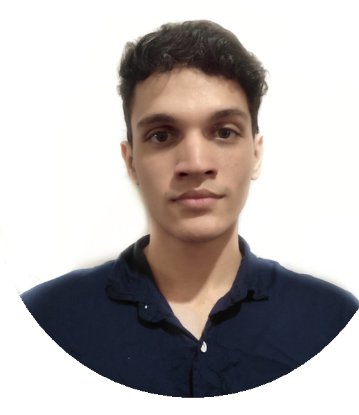

<div align="center">

  

  # Jeremy Posada
  ### Junior Software Developer | Backend & Full Stack Specialist

  <p align="center">
    <a href="mailto:jeremyposada2003@gmail.com"></a>
    <a href="https://wa.me/573043620454"></a>
    <a href="https://github.com/Xdewilo"></a>
  </p>

  <p align="center">
    <a href="assets/docs/Jeremy_Posada_CV_ES.pdf">
      
    </a>
    <a href="docs/cv_en.md">
      
    </a>
  </p>

</div>

---

## 📌 Tabla de Contenidos
- [Sobre Mí](#-sobre-mí)
- [Stack Tecnológico](#-stack-tecnológico)
- [Experiencia Laboral](#-experiencia-laboral)
- [Educación y Formación](#-educación-y-formación)
- [Estructura del Repositorio](#-estructura-del-repositorio)
- [Contacto](#-contacto)

---

## 👨‍💻 Sobre Mí

Soy estudiante de últimos semestres de **Ingeniería de Sistemas**, apasionado por el desarrollo backend, la arquitectura limpia y la construcción de aplicaciones web eficientes y escalables.

Cuento con experiencia demostrable en:
- **Migración de arquitecturas heredadas** (refactorización de PHP puro a Laravel estructurado).
- **Procesamiento y automatización de datos** (migraciones desde Access y Excel a bases de datos relacionales).
- **Diseño y optimización de bases de datos** (normalización e indexación en MySQL y PostgreSQL).
- **Desarrollo de interfaces intuitivas y seguras** integrando REST APIs, autenticación por roles y diseño con Tailwind CSS.

Mi enfoque se centra en la organización del código, la calidad técnica y el trabajo colaborativo orientado a resultados de alto impacto.

---

## 🛠️ Stack Tecnológico

### **Backend & APIs**


### **Frontend & UI**


### **Bases de Datos & Almacenamiento**


### **Herramientas & Entornos**


---

## 💼 Experiencia Laboral

### **Junior Full Stack Developer** | *RIB Logistic SAS*
> Desarrollo web, automatización de procesos logísticos e integración de datos.

- 🔄 **Migración a Laravel:** Modernización de plataformas heredadas de PHP nativo a Laravel, optimizando el ciclo de vida del software, la seguridad y la arquitectura MVC.
- 📊 **Carga Automatizada (ETL):** Implementación de scripts y módulos de carga masiva de datos desde hojas de cálculo Excel y bases de datos Access hacia entornos SQL centralizados.
- ⚡ **Optimización SQL:** Normalización de esquemas relacionales, mejorando la integridad referencial y acelerando tiempos de consulta para reportes operacionales.
- 🔐 **Autenticación & UI:** Diseño de paneles administrativos y sistemas de login/permisos responsivos utilizando Tailwind CSS.
- 📦 **Módulo de Logística:** Generación automática de guías de despacho y códigos de barras para empresas asociadas como **Triple A** y **Efigas**.

---

## 🎓 Educación y Formación

- **Institución Universitaria Americana**
  - *Tecnólogo en Programación de Computadores* (En proceso de culminación)
  - *Técnico en Programación de Computadores* (Graduado)
- **Escuela San Carlos Borromeo**
  - *Bachiller Académico con Honores y Énfasis Técnico*
- **Open English**
  - *Inglés Conversacional Básico / Intermedio* (6 meses de formación)

---

## 📁 Estructura del Repositorio

```text
CV/
├── .gitignore                      # Reglas de exclusión para Git (archivos del sistema y temporales)
├── README.md                       # Perfil interactivo y presentación para GitHub
├── assets/
│   ├── docs/
│   │   └── Jeremy_Posada_CV_ES.pdf # Hoja de vida oficial en formato PDF
│   └── images/
│       ├── avatar.png              # Foto de perfil optimizada
│       └── cv_preview.png          # Vista previa del documento original
└── docs/
    ├── cv_es.md                    # Versión completa y editable en Español (ATS-friendly)
    └── cv_en.md                    # Versión completa en Inglés (English version)
```

---

## 📞 Contacto y Referencias

- **Email:** [jeremyposada2003@gmail.com](mailto:jeremyposada2003@gmail.com)
- **WhatsApp / Teléfono:** [+57 304 362 0454](https://wa.me/573043620454)
- **Perfil GitHub:** [@Xdewilo](https://github.com/Xdewilo)
- **Referencia Profesional:** Waldir Bonilla (Director de Proyectos - RIB Logistic SAS) — *Tel: (+57) 301 417 7306*
